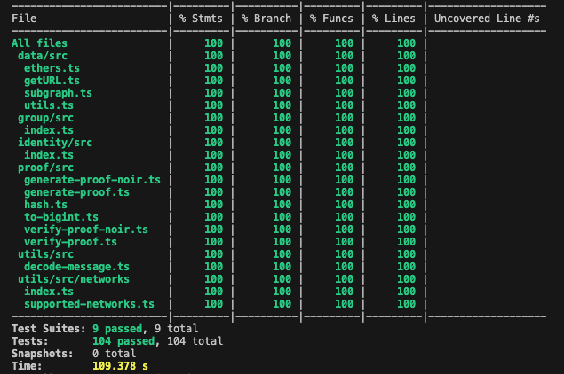

# Statistics

## Test coverage

Tests have been added for the new SDK functionality in `generate-proof-noir` and `verify-proof-noir`:

In addition, we've added tests for the Noir circuit in `packages/circuits-noir`, both in [TypeScript](https://github.com/hashcloak/semaphore-noir/blob/noir-support/packages/circuits-noir/tests/semaphore-noir.test.ts) and directly [in Noir itself](https://github.com/hashcloak/semaphore-noir/blob/noir-support/packages/circuits-noir/src/main.nr#L88-L258). There is, as far as we know, no test coverage tool for a Noir circuit, which is why it is not included in the table.

## Benchmarks

For benchmarking we cloned the existing Semaphore benchmarking repo and updated the browser and node benchmarks accordingly. Those benchmark the Semaphore-Noir SDK functionality (`generateNoirProof` and `verifyNoirProof`). The repo also contains the gas estimates in a static json file. 

Additionally, we have benchmarked the gate count directly on the Noir circuit with `bb gates`. 

To get more precise insights on the Noir side, we plan to add benchmarking for witness generation, proving and verifying for the circuit, separately from the SDK. 

### Node Benchmarks

#### Proof Generation
| Function                                           | Avg Time (ms) | Samples |
|----------------------------------------------------|----------------|---------|
| Generate Proof 1 Member [Max tree depth 1]         | 1710.65        | 10      |
| Generate Proof 100 Members [Max tree depth 7]      | 2311.87        | 10      |
| Generate Proof 500 Members [Max tree depth 9]      | 2398.87        | 10      |
| Generate Proof 1000 Members [Max tree depth 10]    | 2600.24        | 10      |
| Generate Proof 2000 Members [Max tree depth 11]    | 3004.17        | 10      |

#### Proof Verification
| Function                                           | Avg Time (ms) | Samples |
|----------------------------------------------------|----------------|---------|
| Verify Proof 1 Member [Max tree depth 1]           | 974.98         | 10      |
| Verify Proof 100 Members [Max tree depth 7]        | 1359.02        | 10      |
| Verify Proof 500 Members [Max tree depth 9]        | 1490.25        | 10      |
| Verify Proof 1000 Members [Max tree depth 10]      | 1527.17        | 10      |
| Verify Proof 2000 Members [Max tree depth 11]      | 1898.70        | 10      |

### Browser Benchmarks
#### Proof Generation
| Function                                           | Avg Time (ms) | Samples |
|----------------------------------------------------|----------------|---------|
| Generate Proof 1 Member [Max tree depth 1]         | 978.54         | 10      |
| Generate Proof 100 Members [Max tree depth 7]      | 1543.11        | 10      |
| Generate Proof 500 Members [Max tree depth 9]      | 1717.46        | 10      |
| Generate Proof 1000 Members [Max tree depth 10]    | 1843.71        | 10      |
| Generate Proof 2000 Members [Max tree depth 11]    | 2120.75        | 10      |
### Gas estimates

| Function                                                        |Gas Usage|
|-----------------------------------------------------------------|---------|
| SemaphoreNoir.verifyProof 1 Member [Max tree depth 1]           |1994403  |
| SemaphoreNoir.verifyProof 100 Members [Max tree depth 7]        |2026201  |
| SemaphoreNoir.verifyProof 500 Members [Max tree depth 9]        |2026057  |
| SemaphoreNoir.verifyProof 1000 Members [Max tree depth 10]      |2026129  |
| SemaphoreNoir.verifyProof 2000 Members [Max tree depth 11]      |2026117  |

| Function                                                        |Gas Usage|
|-----------------------------------------------------------------|---------|
| SemaphoreNoir.validateProof 1 Member [Max tree depth 1]         |2135365  |
| SemaphoreNoir.validateProof 100 Members [Max tree depth 7]      |2167151  |
| SemaphoreNoir.validateProof 500 Members [Max tree depth 9]      |2167007  |
| SemaphoreNoir.validateProof 1000 Members [Max tree depth 10]    |2167079  |
| SemaphoreNoir.validateProof 2000 Members [Max tree depth 11]    |2167067  |

### Gate Count

| MAX_DEPTH | acir_opcodes | circuit_size |
|:--------- |:------------ |:------------ |
| 1         | 2822         | 7756         |
| 2         | 3149         | 8696         |
| 3         | 3476         | 9636         |
| 4         | 3803         | 10576        |
| 5         | 4130         | 11516        |
| 6         | 4457         | 12456        |
| 7         | 4784         | 13397        |
| 8         | 5111         | 14336        |
| 9         | 5438         | 15276        |
| 10        | 5765         | 16217        |
| 11        | 6092         | 17157        |
| 12        | 6419         | 18096        |
| 13        | 6746         | 19037        |
| 14        | 7073         | 19977        |
| 15        | 7400         | 20917        |
| 16        | 7727         | 21857        |
| 17        | 8054         | 22797        |
| 18        | 8381         | 23737        |
| 19        | 8708         | 24678        |
| 20        | 9035         | 25617        |
| 21        | 9362         | 26557        |
| 22        | 9689         | 27498        |
| 23        | 10016        | 28438        |
| 24        | 10343        | 29377        |
| 25        | 10670        | 30318        |
| 26        | 10997        | 31258        |
| 27        | 11324        | 32198        |
| 28        | 11651        | 33138        |
| 29        | 11978        | 34078        |
| 30        | 12305        | 35018        |
| 31        | 12632        | 35959        |
| 32        | 12959        | 36898        |
